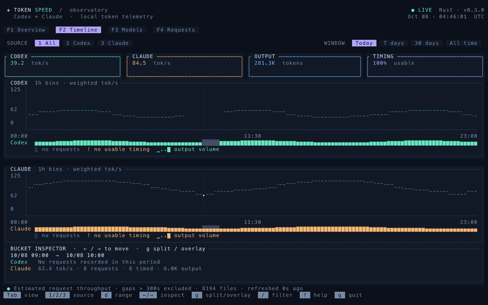
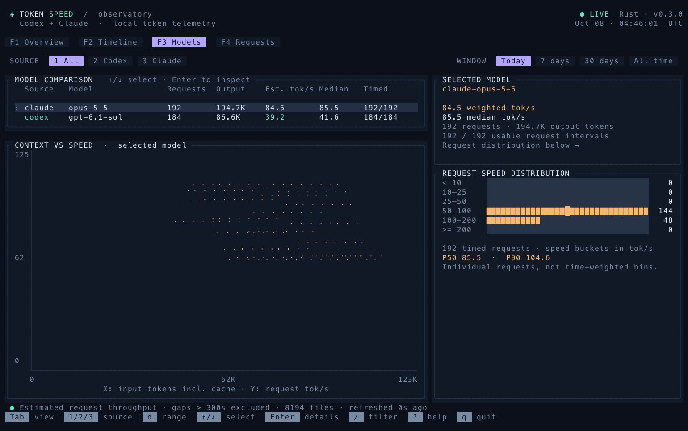
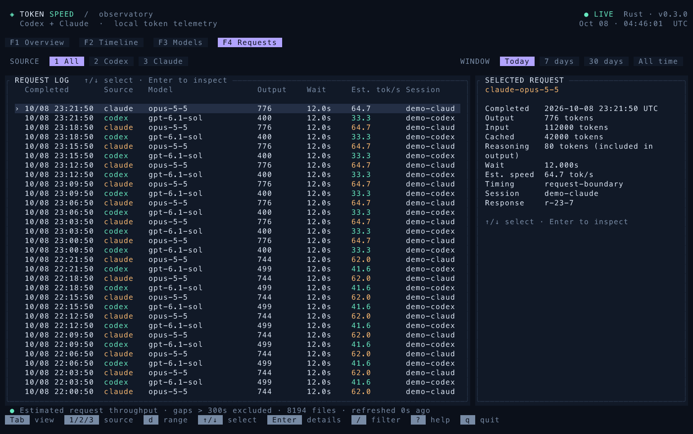

<div align="center">

# token-speed

**Your coding agents, at a glance.**

A terminal observatory for Codex and Claude Code.<br>
Four views. Local logs. One native Rust binary.

[](https://github.com/william1010121/token-speed/actions/workflows/ci.yml)
[](https://github.com/william1010121/token-speed/releases/latest)
[](https://www.rust-lang.org/)
[](LICENSE)

[Quick start](#quick-start) · [Views](#four-ways-to-read-your-work) · [CLI](#scriptable-by-design) · [Metrics](docs/metrics.md) · [繁體中文](README.zh-TW.md)


<sub>All screenshots use synthetic demo data.</sub>

</div>

## Why token-speed?

You already have usage logs. See when your agents were active, which models were faster in your workload, and which requests need a closer look — without leaving the terminal.

- **Four connected views:** overview, timeline, models and individual requests. Keep your filters as you move.
- **Honest gaps:** missing activity and missing timing have distinct indicators. Curves never invent measurements between them.
- **Useful comparisons:** weighted throughput, P50/P90, speed distributions and context-size scatter plots.
- **Local by default:** no API keys, model calls or telemetry. An incremental SQLite index keeps subsequent reads fast.
- **Works in scripts:** table, JSON and CSV reports alongside the interactive dashboard.

> [!IMPORTANT]
> **tok/s means estimated request throughput**, calculated from output tokens and log timestamps. It includes reasoning, prefill, network delays and residual waits. It is not pure streaming decode speed or a controlled comparison between providers. Timing coverage stays visible; untimed usage still counts. [Read the measurement details →](docs/metrics.md)

## Quick start

### Prebuilt binary · macOS / Linux

Download the matching archive from [the latest release](https://github.com/william1010121/token-speed/releases/latest), or use GitHub CLI:

```bash
# macOS Apple Silicon; see the table below for other platforms
asset=token-speed-v0.3.0-aarch64-apple-darwin.tar.gz
gh release download v0.3.0 --repo william1010121/token-speed \
  --pattern "$asset" --pattern SHA256SUMS

# Verify before extracting. Linux: sha256sum --ignore-missing -c SHA256SUMS
shasum -a 256 -c SHA256SUMS --ignore-missing
tar -xzf "$asset"
mkdir -p "$HOME/.local/bin"
install -m 755 token-speed "$HOME/.local/bin/token-speed"
token-speed --today
```

| Platform | Archive suffix |
| --- | --- |
| macOS · Apple Silicon | `aarch64-apple-darwin.tar.gz` |
| macOS · Intel | `x86_64-apple-darwin.tar.gz` |
| Linux · x86-64 | `x86_64-unknown-linux-gnu.tar.gz` |
| Linux · ARM64 | `aarch64-unknown-linux-gnu.tar.gz` |

Linux binaries target Ubuntu 22.04 / glibc 2.35 or newer. For older distributions or other platforms, build from source. Windows releases are not currently provided.

### Build from source

Requires **Rust 1.92+** and a C compiler. SQLite is bundled.

```bash
git clone https://github.com/william1010121/token-speed.git
cd token-speed
./install.sh
token-speed --today
```

The installer builds with the committed lockfile and writes to `~/.local/bin`. Set `TOKEN_SPEED_INSTALL_DIR` to change the destination. If needed, add `export PATH="$HOME/.local/bin:$PATH"` to your shell profile.

Use a truecolor terminal. **120 × 40** is recommended; **80 × 24** uses a compact layout. The minimum is **60 × 20**.

## Four ways to read your work

| View | What you see |
| --- | --- |
| **Overview** | Large throughput cards, activity map, latest requests and model rankings. |
| **Timeline** | Split or overlaid provider curves, coverage strips and a movable bucket inspector. |
| **Models** | A comparison table, P50/P90, rate histogram and input-size / throughput scatter plot. |
| **Requests** | A scrollable request ledger with token counts, timing quality and session details. |

<details>
<summary><strong>Timeline</strong> · See exactly why a curve has a gap</summary>



Press `g` for split / overlay. Use `←` / `→` to inspect a bucket. `░` means no requests; `!` means usage without usable timing. Colored blocks indicate output volume, normalized within each provider. The inspector explains the selected bucket.

</details>

<details>
<summary><strong>Models</strong> · Compare distributions, not just averages</summary>



Select a model to inspect its P50/P90, request-rate distribution and context-size relationship.

</details>

<details>
<summary><strong>Requests</strong> · Follow a number back to a request</summary>



Inspect individual responses and the interval used to estimate throughput. Press `Enter` for expanded details.

</details>

```bash
token-speed                         # Last seven days, Overview
token-speed --today --view timeline
token-speed --days 30 --view models
token-speed --provider claude --model opus --view requests
```

## Keyboard-first, mouse-friendly

| Key | Action |
| --- | --- |
| `Tab` / `Shift-Tab`, `F1`–`F4` | Switch views; navigation labels are clickable |
| `1` / `2` / `3` | All / Codex / Claude |
| `t` / `w` / `m` / `a`, `d` | Today / 7 days / 30 days / all; cycle range |
| `/`, `Esc` | Filter by model or session; close / clear |
| `↑` / `↓`, `j` / `k`, mouse wheel | Select rows; `Home` / `End` jump to ends |
| `←` / `→`, `g` | Timeline bucket / split or overlay |
| `Enter` | Request details |
| `Space`, `r` | Pause automatic updates / refresh |
| `?`, `q` / `Ctrl-C` | Help / quit |

Updates run in the background every five seconds. `--interval` adjusts this. The TUI retains at least 200 recent requests; `--limit` can increase that window.

## Scriptable by design

```bash
# Plain text table with borders and a weighted total row
token-speed --table --today

# JSON summary (stdout contains only JSON)
token-speed --json --days 7 > speed.json

# Hourly throughput today
token-speed summary --today --group hour

# Model comparison over a longer period
token-speed summary --days 30 --group model --provider codex

# Recent responses, or machine-readable exports
token-speed recent --today --limit 20
token-speed recent --json --today --limit 20 > requests.json
token-speed summary --days 7 --format json > speed.json
token-speed recent --days 30 --format csv > requests.csv

# Inclusive dates in a specific timezone
token-speed --since 2026-10-01 --until 2026-10-08 --timezone Asia/Taipei
```

`--table`, `--json`, or an explicit `--format` produce a report even in an interactive terminal. With no options, the dashboard remains the default. `summary` and `recent` always produce reports; with no interactive terminal, the default command produces a report too. `watch` requires an interactive terminal and uses the dashboard. Run `token-speed --help` for every option.

Text tables have borders, right-aligned numeric columns and, for summaries, a total row computed from all matching requests. Missing or excluded timing appears as `—`; those requests still contribute to usage totals. JSON keeps the existing `metric`, `max_gap_seconds`, `timezone`, `metadata` and `data` fields. Missing speeds are `null`; recent requests also include `timing_status` (`estimated`, `missing`, or `excluded`).

| Option | Purpose |
| --- | --- |
| `--provider all\|codex\|claude` | Choose source |
| `--model`, `--session` | Substring filters |
| `--today`, `--days N`, `--all-time`, `--since`, `--until` | Time range |
| `--timezone` | IANA timezone; defaults to `TZ` or local timezone |
| `--view` | Initial dashboard view |
| `--table`, `--json` | One-shot text table or JSON report; bypass the TUI |
| `--group hour\|day\|model`, `--format table\|json\|csv` | Report grouping and format |
| `--max-gap SECONDS` | Maximum usable timing interval; default 300 |
| `--codex-dir`, `--claude-dir`, `--cache` | Override source / index locations |
| `--refresh` | Rebuild cached entries |

## Your logs stay on your machine

| Source | Default location | Override |
| --- | --- | --- |
| Codex | `~/.codex/{sessions,archived_sessions}` | `CODEX_HOME` or `--codex-dir` |
| Claude Code | `~/.claude/projects` | `CLAUDE_CONFIG_DIR` or `--claude-dir` |
| SQLite index | `~/.cache/token-speed/index.sqlite3` | `XDG_CACHE_HOME` or `--cache` |

The parser includes subagent logs and deduplicates supported usage records. The cache stores token counts, timestamps, model names, session identifiers and source paths. It does **not** store prompts or tool-output bodies. Reports can contain session identifiers and file paths; redact them before sharing.

The first run indexes your history. Later runs scan file metadata and reparse changed files. An incomplete JSONL tail is skipped and retried when the file changes. See [metrics and parser behavior](docs/metrics.md) for schema limitations.

## Contributing

Run `cargo test --locked`, `cargo clippy --locked --all-targets -- -D warnings`, and `cargo fmt --check`. Use synthetic fixtures; never commit personal agent logs. [Contributing guide](CONTRIBUTING.md) · [Codex review setup](docs/codex-review.md) · [Changelog](CHANGELOG.md).

Built with [Ratatui](https://ratatui.rs/) and [Crossterm](https://github.com/crossterm-rs/crossterm). Independent community project; not affiliated with OpenAI or Anthropic.

[MIT license](LICENSE).
