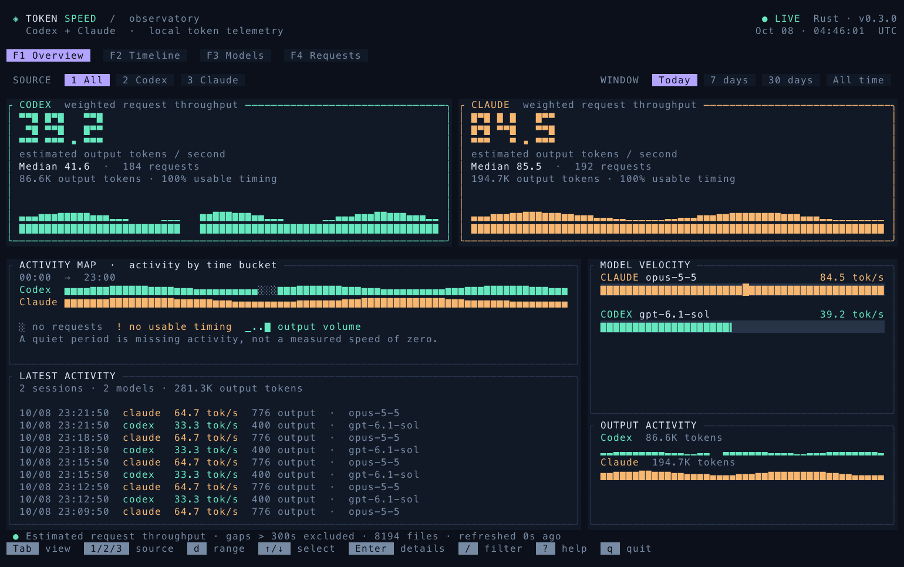

# token-speed

[English](README.md) · **繁體中文**

[](https://www.npmjs.com/package/token-speed)

Rust + [Ratatui](https://ratatui.rs/) 打造的 Codex／Claude token 速度 TUI。四個 view、深色介面、大字速度摘要、薄荷綠／琥珀色曲線、模型分布圖與 token 活動圖。讀取本機紀錄，不發送模型 API 請求。



預覽使用示範資料；啟動後顯示你的真實本機紀錄。

## 安裝

### npm（macOS／Linux）

```sh
npm install -g token-speed
token-speed --today
```

需要 Node.js 18 以上。套件內附 macOS Apple Silicon／Intel 與 Linux ARM64／x86-64 原生執行檔，不需要 Rust，也沒有安裝腳本。Linux 需要 glibc 2.35 以上；目前不支援 Windows 或 Alpine 等 musl 系統。

直接試用：`npx --yes token-speed --today`。更新：`npm install -g token-speed@latest`。

### Cargo（從指定 release 編譯）

需要 Rust 1.92 以上與 C 編譯器；SQLite 已內含，不必手動 clone：

```sh
cargo install --git https://github.com/william1010121/token-speed \
  --tag v0.3.0 --locked
token-speed --today
```

預設安裝到 `~/.cargo/bin`，請確認已加入 `PATH`。此指令直接使用 Git，不依賴 crates.io 發布；更新時改用新版 release tag 重跑即可。macOS 若遇到自訂編譯器封裝造成的 SDK／linker 錯誤，可設定 `CC=/usr/bin/clang` 與 `CARGO_TARGET_AARCH64_APPLE_DARWIN_LINKER=/usr/bin/clang`；Intel 對應 `CARGO_TARGET_X86_64_APPLE_DARWIN_LINKER`。

也可以從 [Releases](https://github.com/william1010121/token-speed/releases/latest) 下載預編譯執行檔。

## 使用

```sh
# 直接開啟 TUI，預設最近七天
 token-speed

# 今日／指定模型／指定時區
 token-speed --today
 token-speed --provider codex --model gpt --timezone Asia/Taipei

# 自訂時間範圍（包含 10/08 當天）
 token-speed --since 2026-10-01 --until 2026-10-08

# 純文字表格：框線、數字靠右、加權總計列
 token-speed --table --today

# JSON 匯出
 token-speed --json --days 7 > speed.json
 token-speed recent --json --today --limit 20 > requests.json

# 分組報表與其他匯出格式
 token-speed summary --today --group hour
 token-speed recent --today --limit 20
 token-speed summary --today --format json > speed.json
 token-speed recent --days 30 --format csv > requests.csv
```

不帶參數會開啟 TUI；`watch` 需要互動終端，預設每五秒背景更新，`--interval` 可更改更新間隔。`--table`、`--json` 或明確指定 `--format table/json/csv` 都直接輸出一次報表。一般 `summary`／`recent` 不進入 TUI，沒有互動終端時預設指令也會輸出報表，方便 shell pipeline。

文字表格有完整框線與靠右的數字欄，摘要另有總計列，速度從全部符合條件的有效請求重新加權計算。缺少時間或被排除的區間顯示 `—`，用量仍計入總數。JSON 的 stdout 只有 JSON，保留 `metric`、`max_gap_seconds`、`timezone`、`metadata` 和 `data`；缺少速度是 `null`，逐筆回覆另有 `timing_status`（`estimated`／`missing`／`excluded`）。

建議終端至少 **120 × 40**；80 × 24 會切換成精簡布局，保留核心速度圖與可捲動表格。至少需要 60 × 20。支援 truecolor 的終端可呈現完整配色。

## 四個 view

| View | 用途 |
| --- | --- |
| **Overview**（預設） | 大字速度摘要、活動時段圖、最近動態與模型排名 |
| **Timeline** | 分開／疊加速度曲線、可移動時間游標、逐時間桶的用量與資料空缺 |
| **Models** | 模型表、選取模型的速度分布與 P50／P90、上下文大小與速度散點圖 |
| **Requests** | 回覆列表與同步更新的詳細資料側欄 |

`Tab`／`Shift-Tab` 循環切換，`F1`–`F4` 直接跳轉；也可以點擊上方 view 標籤。來源、時間範圍與篩選條件在切換 view 時保留。

```sh
token-speed --today --view timeline
token-speed --today --view models
```

較小視窗的時間頁自動使用疊加圖，確保曲線與時間桶資訊仍可閱讀。一般視窗按 `g` 切換分開／疊加，`←`／`→` 或滑鼠滾輪檢查每個時間桶。曲線下的活動條用 `░` 明示沒有請求、`!` 明示有 usage 但無可用時間，彩色 `▁..█` 表示輸出量；活動條在各來源內正規化。空缺不插值成速度，也不補零。右側或下方 inspector 說明選取時間桶的原因與實際資料。

[時間分析預覽](docs/preview-timeline.png) · [模型比較預覽](docs/preview-models.png) · [回覆列表預覽](docs/preview-requests.png)

## 快捷鍵

| 按鍵 | 功能 |
| --- | --- |
| `1` / `2` / `3` | 全部／Codex／Claude |
| `d` | 循環切換時間範圍 |
| `t` / `w` / `m` / `a` | 今日／7 天／30 天／全部 |
| `Tab` / `Shift-Tab` / `v` | 下一個／上一個 view |
| `F1`–`F4`、上方標籤 | 直接切換 view |
| `g`（Timeline） | 分開／疊加曲線 |
| `←` / `→`（Timeline） | 檢查時間桶 |
| `↑` / `↓`、`j` / `k`、滑鼠滾輪 | 選取表格列 |
| `Home` / `End` | 表格第一列／最後一列 |
| `Enter` | 查看完整 token、時間與 session 資料 |
| `/` | 即時篩選模型名稱或 session ID |
| `Esc` | 關閉對話框／清除篩選 |
| `Space` | 暫停／恢復自動更新 |
| `r` | 手動更新 |
| `?` | 快捷鍵與計算說明 |
| `q` / `Ctrl-C` | 退出並恢復終端 |

TUI 的最近回覆列表保留最近 200 筆，`--limit` 大於 200 時會增加可檢視筆數。文字 `recent --limit` 則依指定筆數輸出。

## 畫面如何讀

- **CODEX／CLAUDE**：目前時間範圍內的加權平均輸出 tokens/s。
- **OUTPUT**：所有匹配回覆的輸出 token 數。
- **TIMING**：具備可用時間區間的請求比例。
- **THROUGHPUT**：按時間分桶的加權速度；沒有可用資料的區間會斷線，不當作速度為零。
- **MODEL VELOCITY**：按估計速度排序的模型比較條圖。
- **OUTPUT ACTIVITY**：各時間桶的輸出 token 活動量。兩者使用相同縱向比例。
- **Models／Requests**：可捲動、可逐筆檢視的比較表格。

今日用 1 小時桶，七天用 6 小時桶，30 天用日桶；更長範圍約 48 桶。分桶按回覆完成時間，跨桶請求歸到完成時所在的桶。日桶為固定 24 小時；在夏令時間切換期間不等同於當地曆日，軸標籤仍以指定時區顯示。

## 計算定義與資料規劃

1. **來源**：Codex `$CODEX_HOME/sessions` 與 `archived_sessions`；Claude `$CLAUDE_CONFIG_DIR/projects`。預設是 `~/.codex`、`~/.claude`，包含子代理自己的 `.jsonl`。可用 `--codex-dir`、`--claude-dir` 改根目錄。
2. **計算單位**：每次有 usage 的模型回覆，而非整個使用者回合。一次工具往返可能产生多次模型回覆。
3. **去重**：Codex 優先採 `token_usage_record.usage`，按 session／response ID 去重，排除父紀錄中鏡射的其他 thread usage。同一檔案有新格式時忽略舊 `token_count`。只有舊格式時採累積差額，跳過重複快照；累積重置採 `last_token_usage`。Claude 按 session／message ID 合併內容區塊，usage 欄位取最大值，完成時間採最後區塊；跨檔再去重。
4. **時間區間**：Codex 用 user／task start、工具結果或前次 usage 到本次 usage。Claude 沿 `parentUuid` 找同一 branch 的 user（包括 tool result）或前次模型回覆，採前次回覆最後區塊時間，避免混入平行 branch。
5. **速度**：`output_tokens / estimated_request_seconds`。包含 prefill、reasoning、網路、重試和仍無法分離的等待；它是估計請求吞吐量，不能解讀成純 decode tokens/s。reasoning 已包含於 output，不再額外加總。
6. **不計速度的資料**：沒有起點、非正時間或超過 `--max-gap`（預設 300 秒）的區間，速度顯示 `—`；usage 仍計入。長時間真實模型請求也可能被排除，門檻可調。
7. **聚合**：`有效 output tokens 總和 / 有效區間秒數總和`；Median 為各有效請求速度的中位數。平行請求各自累計區間，秒數不是整體牆鐘時間。不同 tokenizer、上下文與 reasoning 工作量會影響結果，供應商比較不是受控 benchmark。
8. **Input**：Codex input 已包含 cache；Claude 的 input 加上 cache read 與 cache write。Cached 是 input 的子集。JSON／CSV 保留 input、cached、cache write、output、reasoning、有效秒數與時間品質。
9. **快取**：首次完整索引，後續比對路徑、檔案大小與奈秒 mtime，重讀有變動的檔案。SQLite 只保存模型、session、時間與 token metadata，不保存 prompt 或工具輸出。來源消失時不納入報表。預設 `~/.cache/token-speed/index.sqlite3`，跟隨 `XDG_CACHE_HOME`；可用 `--cache` 改位置，`--refresh` 重建。
10. **互動更新**：索引在背景 thread 執行，更新時仍可操作 TUI。載入失敗會顯示原因並保留已有畫面，可按 `r` 重試。正在寫入的最後一行若不完整，跳過並記錄警告，下次變動時重讀。

`--until YYYY-MM-DD` 包含該日，完整 ISO 時間則為排他的上界。`--timezone`／`TZ` 接受 IANA 時區；未設定時使用系統本地時區，包括歷史夏令時間。時區模糊或不存在的自訂本地時間需提供明確 UTC offset。

## 安裝／開發

```sh
git clone https://github.com/william1010121/token-speed.git
cd token-speed
./install.sh
```

編譯後安裝單一原生執行檔到 `~/.local/bin/token-speed`，執行不需要 Python。可用 `TOKEN_SPEED_INSTALL_DIR` 指定安裝目錄。需要 Rust 1.92 以上及 C 編譯器。也可以從 [Releases](https://github.com/william1010121/token-speed/releases/latest) 下載 macOS／Linux 的預編譯執行檔。

```sh
cargo test --locked
cargo clippy --locked --all-targets -- -D warnings
cargo fmt --check
```

macOS 專案設定使用 Apple Clang linker，避免 PATH 中其他 `cc` 封裝找不到系統 SDK。Linux 使用 Cargo 預設 linker。

維護者的 npm 打包與發布流程見 [publishing.md](docs/publishing.md)。

程式分為 `args`（命令列）、`data`（解析與快取）、`report`（文字表格與匯出）、`app`（狀態與背景索引）、`ui`（Ratatui 畫面）。測試涵蓋資料去重、累積重置、工具區間、branch、加權速度、快取失效、日期與時區、互動操作，以及 140×46 到 60×20 的布局和過小視窗。

## 邊界

歷史檔通常缺完整的 request start／first token／last token 對應，估計區間仍可能含工具或協調空檔。沒有 Claude parent 資料時仍顯示 usage，但速度缺失。Codex 混合格式檔案採新格式，舊格式獨有 usage 可能遺漏；首次舊累積快照只採 last usage，不推造先前請求。

要做真正生成速度，需要另設 stream 量測模式，捕捉首末 token 時間；此版沒有額外模型呼叫或費用。TUI 是定期更新回覆統計，沒有逐 token 串流資料。
